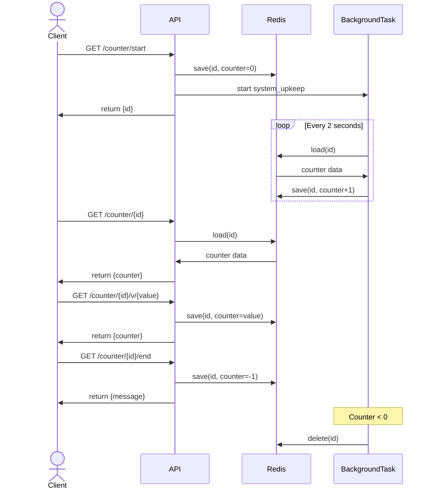

# litestar_background_counter

litestarのバックグラウンド機能を用いた、カウンターの実装をしてみた

## 使い方

1. `docker compose up`の実行
2. appコンテナ内で
```bash
poetry run litestar --app basic:app workers run
```

### TL;DR
- githubに公開しています
    - https://github.com/sion908/litestar_background_counter
    - cloneしてdockerを立ち上げれば起動できます
- tcpの接続を維持するために接続からはバックグラウンドタスクに移行
- 以降はインメモリである、redisに通信するデータの情報をおくことで、接続を解除することなく、データの送受信および制御が行えるようになる


### 動作環境・使用するツールや言語
dockerで動くようにしています
- OS バージョン
    - Mac book pro 13
- ツール
    - docker 
- 言語
    - Python 3.11
- フレームワーク
    - litestar 2.13.0
    - redis 5.2.1

## 実装内容

作成したアプリの流れ



## 参考資料

- [バックグラウンドタスク(litestar)](https://docs.litestar.dev/latest/usage/responses.html#background-tasks)
- [redisのgithub](https://github.com/redis/redis-py)
